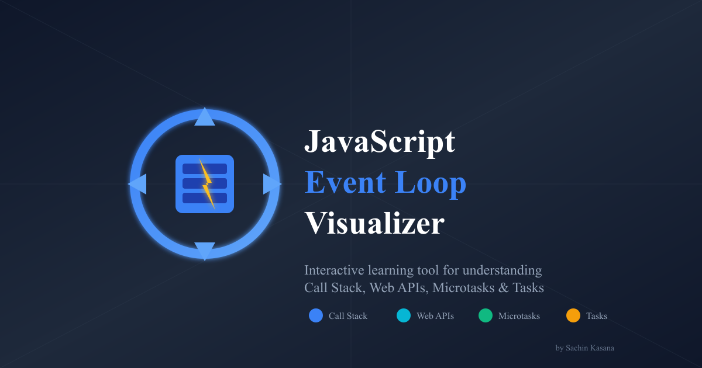

# JavaScript Event Loop Visualizer 🔄

[](https://your-domain.vercel.app)
[](https://web.dev/progressive-web-apps/)
[](https://opensource.org/licenses/MIT)

An interactive, educational visualization tool to understand how JavaScript's event loop works. Perfect for developers learning asynchronous JavaScript concepts.



## ✨ Features

### Core Functionality
- 🎯 **Visual Call Stack** - Watch functions push and pop in real-time
- 🔄 **Event Loop Animation** - See exactly how the event loop processes queues
- ⏱️ **Web APIs** - Visualize setTimeout, fetch, and other async operations
- 📋 **Task Queue** - Understand macrotask scheduling (setTimeout, setInterval)
- ⚡ **Microtask Queue** - See how Promises get priority over tasks

### Interactive Controls
- ▶️ **Play/Pause** - Auto-advance or step through manually
- ⏮️⏭️ **Step Navigation** - Go forward/backward through execution
- 🏃 **Speed Control** - 5 speed levels from 0.25x to 3x
- 🔄 **Reset** - Start over at any time

### Learning Features
- 📚 **11 Pre-built Examples** - From basic setTimeout to Promise.race
- ✏️ **Custom Code Mode** - Write and visualize your own async code
- 💡 **Step Explanations** - Detailed descriptions of each execution step
- 🎨 **Syntax Highlighting** - Color-coded code with line highlighting

### Production Ready
- 📱 **PWA Support** - Install as app, works offline
- ⌨️ **Keyboard Shortcuts** - Full keyboard navigation
- 🔍 **SEO Optimized** - Meta tags, Open Graph, structured data
- ♿ **Accessible** - ARIA labels and screen reader support

## 🚀 Quick Start

### Prerequisites
- Node.js 18+ 
- npm or yarn

### Installation

```bash
# Clone the repository
git clone https://github.com/yourusername/event-loop-visualizer.git
cd event-loop-visualizer

# Install dependencies
npm install

# Start development server
npm run dev
```

Open [http://localhost:5173](http://localhost:5173) in your browser.

### Build for Production

```bash
# Create optimized build
npm run build

# Preview production build locally
npm run preview
```

## ⌨️ Keyboard Shortcuts

| Key | Action |
|-----|--------|
| `Space` | Play/Pause animation |
| `←` / `→` | Previous/Next step |
| `↑` / `↓` | Increase/Decrease speed |
| `R` | Reset visualization |
| `Home` | Jump to first step |
| `End` | Jump to last step |
| `1-9` | Select example (1-9) |
| `0` | Select example 10 |
| `-` | Select example 11 |
| `?` | Toggle help modal |

## 📚 Available Examples

1. **Basic Example** - Simple setTimeout and console.log
2. **Promises & Microtasks** - Shows microtask priority over tasks
3. **Nested Callbacks** - Multiple setTimeout with ordering
4. **Fetch API** - Network requests with Web APIs
5. **Async/Await** - Modern async syntax visualization
6. **Multiple Promises** - Complex Promise chains
7. **Event Listener** - User interaction handling
8. **API Error Handling** - try/catch with async operations
9. **Debounce Pattern** - Common utility implementation
10. **Promise.race** - Racing multiple async operations
11. **requestAnimationFrame** - Browser rendering cycle

## 🛠️ Tech Stack

- **React 18** - UI library with hooks
- **TypeScript** - Type safety
- **Vite** - Fast build tool
- **Tailwind CSS** - Utility-first styling
- **Lucide React** - Beautiful icons
- **html2canvas** - Screenshot export

## 📁 Project Structure

```
event-loop-visualizer/
├── public/
│   ├── icons/          # PWA icons (72x72 to 512x512)
│   ├── favicon.svg     # Browser tab icon
│   ├── og-image.png    # Social sharing image
│   ├── manifest.json   # PWA manifest
│   ├── robots.txt      # SEO crawler rules
│   ├── sitemap.xml     # URL sitemap
│   └── sw.js           # Service worker
├── src/
│   ├── components/
│   │   └── EventLoopVisualizer.tsx  # Main component
│   ├── App.tsx
│   ├── main.tsx        # Entry point + SW registration
│   └── index.css       # Tailwind imports
├── index.html          # HTML with SEO meta tags
├── tailwind.config.js
├── vite.config.ts
└── package.json
```

## 🎨 Customization

### Adding New Examples

Edit `EventLoopVisualizer.tsx` and add to the `examples` object:

```typescript
myExample: {
  name: 'My Example',
  description: 'Description here',
  code: `console.log("Hello");`,
  steps: [
    { action: 'addToStack', item: 'console.log("Hello")', line: 1, explanation: '...' },
    { action: 'log', message: 'Hello' },
    { action: 'removeFromStack' }
  ]
}
```

### Changing Theme Colors

The app uses a slate/blue monochromatic theme. Key colors in Tailwind classes:
- Background: `bg-slate-900`, `bg-slate-800`
- Primary: `bg-blue-600`, `text-blue-400`
- Accent: `bg-amber-500`, `bg-cyan-500`, `bg-emerald-500`


## 🤝 Contributing

Contributions are welcome! Please feel free to submit a Pull Request.

1. Fork the repository
2. Create your feature branch (`git checkout -b feature/AmazingFeature`)
3. Commit your changes (`git commit -m 'Add some AmazingFeature'`)
4. Push to the branch (`git push origin feature/AmazingFeature`)
5. Open a Pull Request

## 📝 License

This project is licensed under the MIT License - see the [LICENSE](LICENSE) file for details.

## 👤 Author

**Sachin Kasana**
- Website: [sachinkasana-dev.vercel.app](https://sachinkasana-dev.vercel.app/)
- GitHub: [@sachinkasana](https://github.com/sachinkasana)

---

Made with ❤️ by [Sachin Kasana](https://sachinkasana-dev.vercel.app/)
